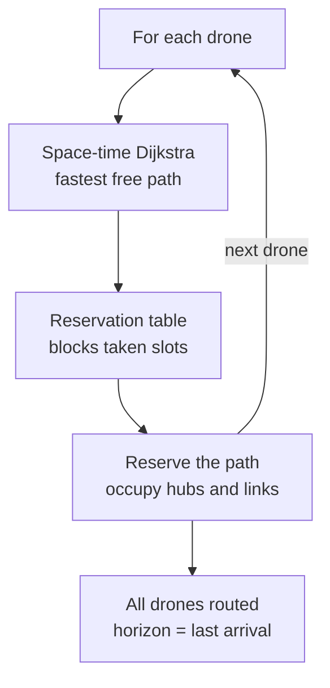

*This project has been created as part of the 42 curriculum by lebeyssa.*

# Description

## FLY-IN
Fly-in is a multi-drone routing simulator. Given a map of zones (hubs) linked by connections, the program computes how to route a set of drones from a start zone to an end zone in the fewest possible turns, while respecting capacity constraints (drones per zone, per connection) and zone types (normal, restricted, priority, blocked).       

Routing relies on a space-time <font color="#e91c0d">Dijkstra</font> algorithm combined with a reservation table: drones are  planned one at a time, each taking the fastest path still available, which naturally spreads  traffic and avoids conflicts.          

A graphical interface (Pygame) lets you view the map and <font color="#e91c0d">animate</font> the drones' movement turn by turn, with zoom, free panning, and a step-by-step mode.   

## algorithm


- **<font color="#e91c0d">1</font> or each drone:** drones are processed one by one, sequentially (never all at once).
- **<font color="#e91c0d">2</font> Space-time Dijkstra:** for the current drone, the algorithm seeks the path that reaches the destination earliest in space-time (hub, time step). The drone can either move or wait in place.
- **<font color="#e91c0d">3</font> Reservation table:** during this search, the reservation table blocks cells/links already occupied by previous drones (Dijkstra automatically avoids them while respecting capacity constraints).
- **<font color="#e91c0d">4</font> Reserve the path:** once the path is found, all the cells and connections it occupies are recorded in the table.
- **<font color="#e91c0d">5</font> Loop (next):** the process moves to the next drone, which sees the space already partially reserved and must maneuver around obstacles or wait.
- **<font color="#e91c0d">6</font> All drones routed:** once all drones are placed, the time horizon (total number of time steps) is the arrival time of the last drone.

## complexity

```
f(D, H, C, T) = (D · (H·T · log(H·T)  +  C·T))
```

**Explication:**

- for T (Tour), we traverse H (Hub), (these represent the states) so:

```
H × T
```

- Dijkstra uses heapq (the priority queue), the queue is organized like a tree, so for each modification:

```
heapq complexity :      heapq organisation :        
                               2
                              / \
    o(log(N))                3   10
                            / \
                           8   5
```
For each state processed, the heap may be modified or reorganized, so:

```
H·T · log(H·T)
```

- In parallel, Dijkstra traverses the list of connections at each step to identify neighboring hubs  
for T (Tour), we traverse C (connection), so:

```
H·T · log(H·T)  +  C·T
```

- This operation is performed for each drone, so we multiply by D (drone):

```
D · (H·T · log(H·T)  +  C·T)
```

## implementation choice:
- **Reservation Table**

Drones are routed one at a time. The reservation table remembers which space-time slots are already taken, so that each new drone can avoid them and no capacity is ever exceeded.


Adding a reservation table makes it possible to find the shortest path for each drone. Without this addition, all the drones would take the same path, and the time factor would not be taken into account (Single-path):  ```f(V, E) = O((V + E)·log(V))```


# Instructions


# Resources