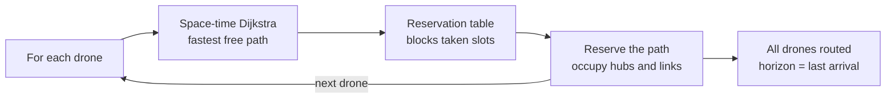

*This project has been created as part of the 42 curriculum by lebeyssa.*

# Description

## FLY-IN
Fly-in is a multi-drone routing simulator. Given a map of zones (hubs) linked by connections, the program computes how to route a set of drones from a start zone to an end zone in the fewest possible turns, while respecting capacity constraints (drones per zone, per connection) and zone types (normal, restricted, priority, blocked).       

Routing relies on a space-time <font color="#e91c0d">Dijkstra</font> algorithm combined with a reservation table: drones are  planned one at a time, each taking the fastest path still available, which naturally spreads  traffic and avoids conflicts.          

A graphical interface (Pygame) lets you view the map and <font color="#e91c0d">animate</font> the drones' movement turn by turn, with zoom, free panning, and a step-by-step mode.

## algorithm


- **<font color="#e91c0d">1</font> or each drone:** drones are processed one by one, sequentially (never all at once).
- **<font color="#e91c0d">2</font> Space-time Dijkstra:** for the current drone, the algorithm seeks the path that reaches the destination earliest in space-time (hub, time step). The drone can either move or wait in place.
- **<font color="#e91c0d">3</font> Reservation table:** during this search, the reservation table blocks cells/links already occupied by previous drones (Dijkstra automatically avoids them while respecting capacity constraints).
- **<font color="#e91c0d">4</font> Reserve the path:** once the path is found, all the cells and connections it occupies are recorded in the table.
- **<font color="#e91c0d">5</font> Loop (next):** the process moves to the next drone, which sees the space already partially reserved and must maneuver around obstacles or wait.
- **<font color="#e91c0d">6</font> All drones routed:** once all drones are placed, the time horizon (total number of time steps) is the arrival time of the last drone.

## complexity

```
f(D, H, C, T) = (D · (H·T · log(H·T)  +  C·T))
```

**Explication:**

- for T (Tour), we traverse H (Hub), (these represent the states) so:

```
H × T
```

- Dijkstra uses heapq (the priority queue), the queue is organized like a tree, so for each modification:

```
heapq complexity :      heapq organisation :        
                               2
                              / \
    o(log(N))                3   10
                            / \
                           8   5
```
For each state processed, the heap may be modified or reorganized, so:

```
H·T · log(H·T)
```

- In parallel, Dijkstra traverses the list of connections at each step to identify neighboring hubs  
for T (Tour), we traverse C (connection), so:

```
H·T · log(H·T)  +  C·T
```

- This operation is performed for each drone, so we multiply by D (drone):

```
D · (H·T · log(H·T)  +  C·T)
```

## implementation choice:
- **Reservation Table**

Drones are routed one at a time. The reservation table remembers which space-time slots are already taken, so that each new drone can avoid them and no capacity is ever exceeded.


Adding a reservation table makes it possible to find the shortest path for each drone. Without this addition, all the drones would take the same path, and the time factor would not be taken into account (Single-path):  ```f(V, E) = O((V + E)·log(V))```

## graphical choice:

The simulation needs to animate many drones moving in real time across the map, turn by turn, with interactive controls (zoom, panning, step-by-step playback). Pygame was chosen for this because:

- **Real-time rendering loop.** Pygame is built around a simple, explicit frame loop (draw → update → repeat), which maps naturally onto a turn-based animation where drone positions are interpolated between turns every frame.
- **Lightweight and dependency-free.** It relies only on SDL under the hood, with no heavy GUI framework to install or configure — a good fit for a self-contained simulator.
- **Direct low-level drawing.** Drawing hubs, connections, zone symbols, and drone markers only requires basic primitives (circles, lines, polygons), which Pygame exposes directly and renders efficiently.
- **Full input control.** Handling the mouse wheel for zoom, click-drag for panning, and keyboard shortcuts for the step-by-step mode is straightforward through Pygame's event system.

Heavier alternatives (a full GUI toolkit like Qt, or a web-based renderer) would have added complexity and dependencies without benefit, since the project needs a single interactive window rather than a complete application interface. Plotting libraries like Matplotlib were also unsuitable, as they are designed for static or lightly-animated figures rather than a smooth, interactive real-time loop.


# Instructions

## Available arguments
- <font color="#e91c0d">--map</font>
Path to the map.

**Exemple:**

```
 ~/Documents/fly-in>  make run ARGS="--map maps/my_map/01_test.txt"
```

The terminal output returns the drones' positions for the next turn

**Exemple:**

```
 ~/Documents/fly-in>  make run ARGS="--map maps/my_map/02_tes.txt"                                                                                                                                  

pygame 2.6.1 (SDL 2.28.4, Python 3.13.1)
Hello from the pygame community. https://www.pygame.org/contribute.html
D1-start-gate_hell1 D2-start D3-start 
D1-gate_hell1 D2-start-gate_hell1 D3-start 
D1-gate_hell3 D2-gate_hell1 D3-start-gate_hell1 
D1-gate_hell4 D2-gate_hell3 D3-gate_hell1 
D1-impossible_goal D2-gate_hell4 D3-gate_hell3 
D2-impossible_goal D3-gate_hell4 
D3-impossible_goal
```

The simulation starts automatically.

## graphical use

- Press <font color="#e91c0d">Esc</font> to close
- Press <font color="#e91c0d">c</font> to refocus
- Press <font color="#e91c0d"><-</font> and <font color="#e91c0d">-></font> go manual mode
- Press <font color="#e91c0d">escape</font> to quit manual mode
- Press <font color="#e91c0d">r</font> to restart simulation

## Makefile usage

The Makefile provides shortcuts to run and test the project.

- <font color="#e91c0d">make run ARGS="..."</font>
Runs the program with the given map argument.
- <font color="#e91c0d">make install</font>
Installs required dependencies (flake8, mypy, pydantic, pygame).
- <font color="#e91c0d">make debug</font>
Launches the program in Python debugger mode (pdb).
- <font color="#e91c0d">make lint</font>
Runs static analysis (flake8 + mypy in non-strict mode).
- <font color="#e91c0d">make lint-strict</font>
Runs strict type checking with mypy.
- <font color="#e91c0d">make clean</font>
Removes Python cache files and mypy cache.


# Resources

**algorithm:** https://www.datacamp.com/fr/tutorial/dijkstra-algorithm-in-python?dc_referrer=https%3A%2F%2Fwww.google.com%2F     
**heapq:** https://docs.python.org/fr/3/library/heapq.html     
**pygame:** https://www.pygame.org/docs/    

## AI Usage

AI is strictly used for syntax and structural advice
"README.md"