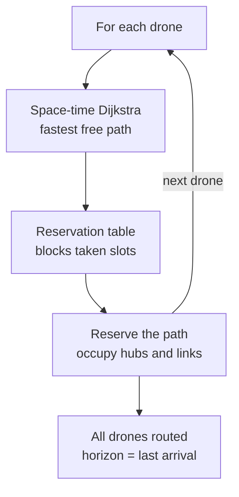
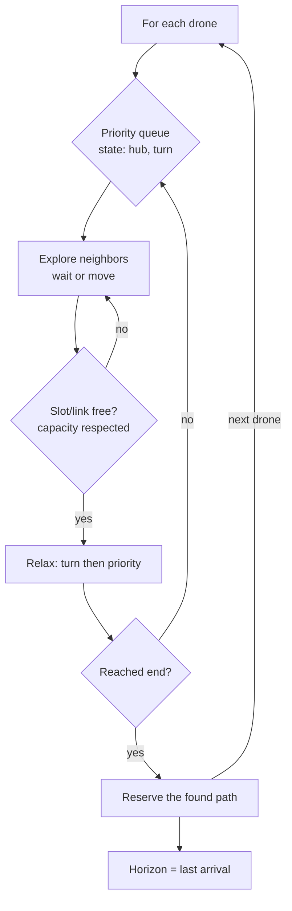

# Algorithm

Fly-in routes drones one at a time using a space-time Dijkstra combined with
a reservation table. Each drone takes the fastest path still available, then
reserves it before the next drone is routed.

## Overview

## Detailed view

